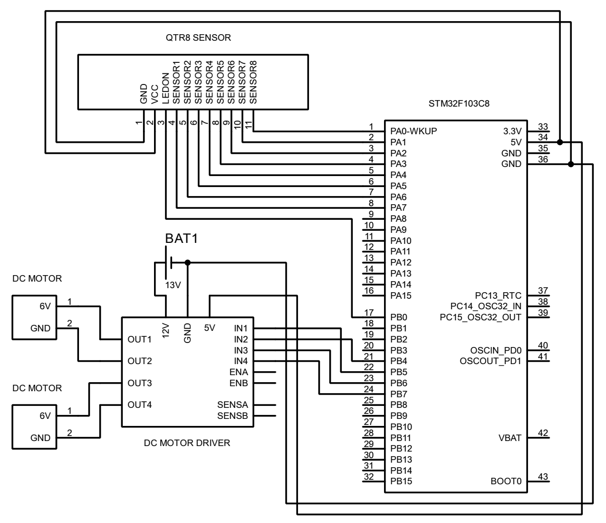

# STM32 Line Follower

# Getting Started

### Components
- STM32 Blue Pill
- Polulu QTR-8RC Sensor Array
- Motor Driver (TB6612FNG OR L298N)
- N20 12V 600 RPM Motors
- N20 44mm Wheels
- 11.1V 1000mAh LiPo Battery
- XT60 Male Connector
- Mini Breadboard (XF-25)
- USB to Serial Converter (CH340G)
- Jumper Wires
- Vero Board
- Female Berg Strip
- Male Berg Strip

### Change in Circuit Diagram
In the Given Circuit Diagram, we are using L298N Motor Driver, but, I have switched to [TB6612FNG](https://preview.redd.it/converting-from-l298n-to-tb6612fng-v0-exiff65gl5dc1.png?width=800&format=png&auto=webp&s=b2a9ef3999cfbf04401dbf7ad121a6785f5cc68d) Motor Driver. If you want to use L298N, Follow the Given Circuit Diagram. The Rest of the Connections are the Same.  The Updated Connections Are:
  - VM -> 12V Battery
  - GND -> 12V Battery
  - GND -> STM32 GND
  - VCC -> STM32 VCC
  - A1 -> Motor 1 Pin 1
  - A2 -> Motor 1 Pin 2
  - B1 -> Motor 2 Pin 1
  - B2 -> Motor 2 Pin 2
  - AIN1 -> STM32 PB5
  - AIN2 -> STM32 PB4
  - BIN1 -> STM32 PB6
  - BIN2 -> STM32 PB7

### Required Software
- [Keil µVision](https://www.keil.com/demo/eval/arm.htm)

### Build the code
Go to `/LineFollower/MDK-ARM` directory and open `LineFollower.uvprojx` project file. You should first build the code and then upload it to the STM32 board. 

## License

This project is licensed under the [MIT License](LICENSE).

### References
- [Samet Öğüten](https://github.com/sametoguten)
- [Bilal Kabaş](https://github.com/bilalkabas)
